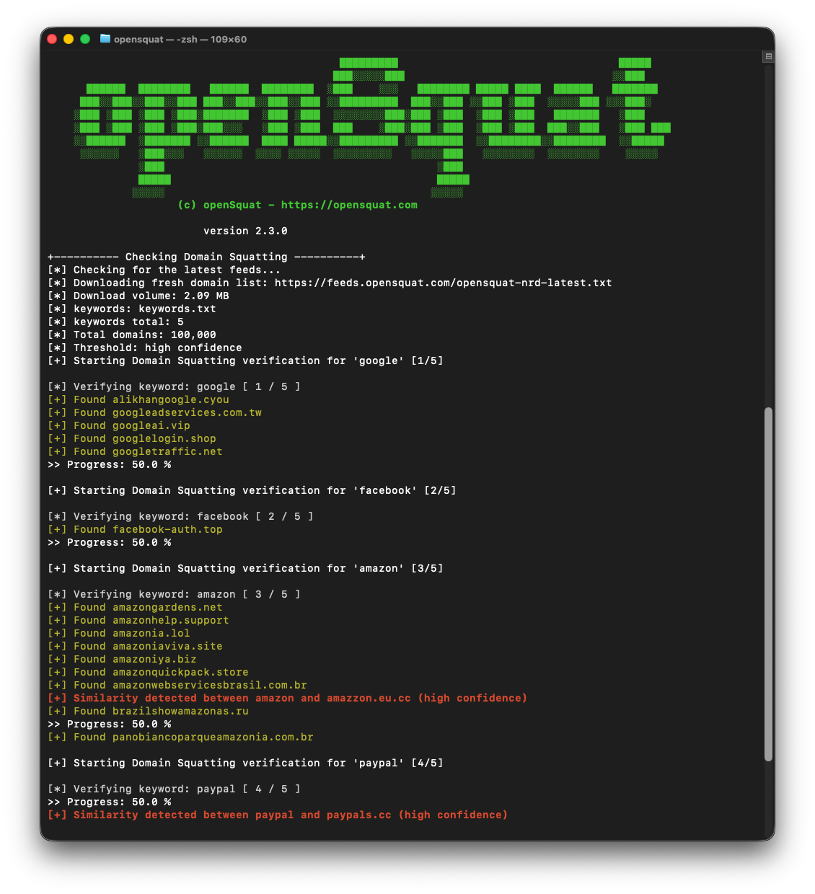

<p align="center">
  
</p>

<h1 align="center">openSquat Core</h1>

<p align="center">
  <a href="https://pypi.org/project/opensquat/"></a>
  <a href="https://www.python.org/downloads/"></a>
  <a href="https://github.com/atenreiro/opensquat/blob/master/LICENSE"></a>
  <a href="https://github.com/atenreiro/opensquat/issues"></a>
  <a href="https://github.com/atenreiro/opensquat/stargazers"></a>
</p>

---

## 📑 Table of Contents

- [What is openSquat?](#-what-is-opensquat)
- [Featured In](#-featured-in)
- [Open-Core Model](#-open-core-model)
- [Key Features](#-key-features)
- [Quick Start](#-quick-start)
- [Requirements](#-requirements)
- [Usage](#-usage)
- [Premium and API Modes](#-premium-and-api-modes)
- [MCP Server](#-mcp-server)
- [Configuration](#%EF%B8%8F-configuration)
- [Automation](#-automation)
- [CLI Reference](#-cli-reference)
- [Contributing](#-contributing)
- [Author](#-author)
- [License](#-license)

---

## 🎯 What is openSquat?

openSquat is an **Open Source Intelligence (OSINT)** security tool that identifies cyber squatting threats targeting your brand or domains:

| Threat Type | Description |
|-------------|-------------|
| 🎣 **Phishing** | Fraudulent domains mimicking your brand |
| 🔤 **Typosquatting** | Domains with common typos (e.g., `gooogle.com`) |
| 🌐 **IDN Homograph** | Look-alike characters from other alphabets |
| 👥 **Doppelgänger** | Domains containing your brand name |
| 🔀 **Bitsquatting** | Single-bit errors in domain names |

---

## 🌟 Featured In

> **"A powerful swiss army knife for brand protection"**
> — [WhoisXML API Blog](https://www.whoisxmlapi.com/blog/orchestrating-open-source-software-and-whois-newly-registered-domain-data-feeds-to-fight-the-typosquatting-plague), August 2022

> **"A handy tool for collecting information on newly registered domains."** — ranked Top 5 phishing detection tool
> — [SOCRadar Blog](https://socradar.io/blog/top-5-tools-for-phishing-domain-detection/), July 2022

> **"openSquat provides essential protection against domain squatting and phishing attacks through automated monitoring and detection."**
> — [Prince Yadav, TutorialsPoint](https://www.tutorialspoint.com/article/opensquat-ndash-domain-squatting-and-phishing-watchdog), March 2026

### Academic Citation

> **"OpenSquat identified 103 squatting domains, 960 active phishing websites, and 53 domains with suspicious certificates."**
> — Sharma et al., [Journal of Information Security and Cybercrimes Research (JISCR)](https://journals.nauss.edu.sa/index.php/JISCR/article/download/2805/1349), Vol. 7, Issue 1, June 2024

---

## 🔓 Open-Core Model

openSquat follows an **open-core model**:

- **Core detection engine** — Open source and community-driven
- **Advanced capabilities** — Delivered through commercial intelligence services

This model enables transparency and community collaboration while supporting the scale, reliability, and operational requirements of enterprise use.

---

## ✨ Key Features

- 📅 **Daily NRD feeds** — Automatic newly registered domain updates
- 🔍 **Similarity detection** — Levenshtein distance algorithm
- 🔓 **Three operating modes** — **Community** (free feed), **Premium Feed** (paid feed, same local pipeline), or **Premium API** (hosted lookalike service). The two Premium modes share a single openSquat API key — see [Premium and API Modes](#-premium-and-api-modes).
- 🛡️ **VirusTotal integration** — Check domain reputation
- 🌐 **Quad9 DNS validation** — Identify malicious domains
- 📜 **Certificate Transparency** — Monitor SSL/TLS certificates
- 📊 **Multiple output formats** — TXT, JSON, CSV

---

## 🚀 Quick Start

### Install via pip (recommended)

```bash
pip install opensquat
opensquat -k keywords.txt
```

### Or clone the repository

```bash
git clone https://github.com/atenreiro/opensquat
cd opensquat
pip install -r requirements.txt
python3 opensquat.py -k keywords.txt
```

> **Repo users:** in all the examples below, replace `opensquat` with `python3 opensquat.py` to run from a cloned checkout.

### See it in action

<p align="center">
  
</p>

---

## 📦 Requirements

- **Python 3.10+**
- Dependencies: `confusable_homoglyphs`, `homoglyphs`, `colorama`, `requests`, `dnspython`, `beautifulsoup4`

---

## 📖 Usage

### Basic Commands

```bash
# Default run
opensquat

# Show all options
opensquat -h

# Use custom keywords file
opensquat -k my_keywords.txt
```

### Validation Options

```bash
# DNS validation via Quad9
opensquat --dns

# Check Certificate Transparency logs
opensquat --ct

# Scan for open ports (80/443)
opensquat --portcheck

# Cross-reference phishing databases
opensquat --phishing results.txt
```

### Output Formats

```bash
# Save as JSON
opensquat -o results.json -t json

# Save as CSV
opensquat -o results.csv -t csv
```

### Confidence Levels

| Level | Flag | Description |
|-------|------|-------------|
| 0 | `-c 0` | Very high (fewer results, high accuracy) |
| 1 | `-c 1` | High (default) |
| 2 | `-c 2` | Medium |
| 3 | `-c 3` | Low |
| 4 | `-c 4` | Very low (more results, more false positives) |

> **Note:** On the API side (`--api`), the five confidence levels map to four fuzziness values (`exact`, `low`, `auto`, `high`) — `-c 3` and `-c 4` both map to `high`. See [Premium and API Modes](#-premium-and-api-modes) for the full mapping and how to override with `--api-fuzziness`.

---

## 💎 Premium and API Modes

openSquat supports three modes. The default (Community) is unchanged — existing users need no flags. The two Premium modes share a single openSquat API key; pick **Premium Feed** if you want the same local detection pipeline with a larger feed, or **Premium API** if you want server-side detection with no local feed download.

| Mode | Flag | What it does |
|------|------|--------------|
| **Community** (default) | _(none)_ | Downloads the free NRD feed (~100k domains/day) and runs local Levenshtein detection. |
| **Premium Feed** | `--premium` | Downloads the paid NRD feed (`nrd-lite`, much larger) using your openSquat API key, then runs the same local Levenshtein detection. |
| **Premium API** | `--api` | Skips local feed download. Queries the openSquat lookalike REST API per keyword and returns server-side matches. |

### Get an API key

Sign up at [opensquat.com](https://opensquat.com) to get a key. The same key works for both Premium Feed (`--premium`) and Premium API (`--api`).

### Provide the API key (priority order)

1. `--api-key YOUR_KEY` on the command line
2. `OPENSQUAT_API_KEY` environment variable
3. `api_key.txt` in the current directory (one key per file, `#` comments allowed)

> The CLI flag is visible in `ps` output. Prefer the env var or key file in shared environments.

### Examples

```bash
# Premium Feed mode — same local pipeline, larger feed
export OPENSQUAT_API_KEY=os_xxxxxxxxxxxx
opensquat -k keywords.txt --premium

# Premium API mode — server-side detection per keyword
opensquat -k keywords.txt --api

# Premium API + DNS reputation check on each returned domain
opensquat -k keywords.txt --api --dns

# Premium API with JSON output grouped by keyword
opensquat -k keywords.txt --api -t json -o results.json

# Tune the Premium API search
opensquat -k keywords.txt --api --api-fuzziness high --api-history-days 7 --api-max-results 200
```

When `--premium` or `--api` successfully loads a key, the CLI prints a masked confirmation line so you can verify which key was picked up without leaking it:

```
[*] API key loaded: os_gL...L5Mb
```

In Premium API mode, the run summary reports the active mode, the number of API calls made, and your remaining balance with usage delta (for example, `4972 (used 4 of 4976 this run)`). Per-keyword progress lines appear in the same order as your keywords file even though the calls run in parallel. Quota exhaustion (HTTP 429) returns partial results gracefully; auth errors (401) and plan errors (403) abort with a clear message.

If the backend rate-limits your request (HTTP 429 with a `Retry-After` header), the tool distinguishes it from quota exhaustion: you'll see a yellow `[!] Rate limit hit (retry in Ns)` warning instead of the red `quota exhausted` message, partial results are still returned, and the summary preserves your real API balance so you can see exactly how many credits you actually used. To avoid triggering rate limits on large scans, pass `--api-rate-limit N` to cap outbound requests per second across all workers. A value of `8` is a safe starting point for most backends.

```bash
# Throttle to 8 requests/second across all workers
opensquat -k keywords.txt --api --api-rate-limit 8
```

### Output format recommendation

**JSON is the recommended output format for Premium API mode** because the API returns per-domain metadata that the other formats cannot carry as cleanly: the registered TLD, the NRD first-seen date, an IDN homograph flag, and the unicode rendering of the homograph when the domain is one.

```bash
opensquat -k keywords.txt --api -t json -o results.json
```

Example of the richer output in Premium API mode (trimmed):

```json
[
  {
    "keyword": "microsoft",
    "domains": [
      {"domain": "securite-microsoft.fr", "tld": "fr", "date": "09-04-2026", "idn": false},
      {"domain": "xn--mirosoft-hw7c.com", "tld": "com", "date": "09-04-2026", "idn": true, "unicode": "miᴄrosoft.com"}
    ]
  }
]
```

The `idn` flag plus the `unicode` rendering let you see at a glance that `xn--mirosoft-hw7c.com` is actually `ᴄ` (Latin Letter Small Capital C) impersonating the `c` in "microsoft" — information that a plain punycode string completely hides.

CSV output is also supported and produces one row per domain with the same metadata columns, which suits analysts working in Excel or pandas:

```bash
opensquat -k keywords.txt --api -t csv -o results.csv
```

The CSV is written with a UTF-8 BOM so Excel on Windows correctly renders the unicode homograph column.

Community and Premium Feed modes emit the same JSON top-level shape for cross-mode consistency, but with only the `domain` field populated per entry — the NRD feed does not carry the per-domain metadata that only the hosted API has:

```json
[
  {
    "keyword": "microsoft",
    "domains": [
      {"domain": "mirosoft.com"},
      {"domain": "mcrosoft.net"}
    ]
  }
]
```

If you pass `--api-key` without also selecting `--premium` or `--api`, the CLI prints a one-line hint that the key will be ignored in Community mode (no silent mode-switching).

In Premium API mode, `-c/--confidence` is auto-mapped to API fuzziness (`0→exact`, `1→low`, `2→auto`, `3→high`, `4→high`). Use `--api-fuzziness` to override.

Premium API (`--api`) is incompatible with `--doppelganger` and `-d/--domains`.

---

## 🔌 MCP Server

openSquat is also available as a **Model Context Protocol (MCP) server**, so AI assistants and agents (Claude, and any other MCP-compatible client) can query lookalike-domain intelligence directly:

| Tool | What it does | Quota cost |
|------|--------------|------------|
| `search_lookalike_domains` | Find newly registered domains impersonating a brand or keyword (phishing, brand abuse, typosquatting) | 1 query per search |
| `validate_api_key` | Confirm the connection is authenticated | Free |

Authentication uses the same openSquat account as the Premium modes: either sign in with OAuth, or supply your API key (`os_...`) via the `Authorization: Bearer` header (or `X-OpenSquat-Key`). Searches draw from the same plan quota as the Premium API.

See [opensquat.com](https://opensquat.com) for the MCP endpoint and client setup instructions.

---

## ⚙️ Configuration

### Keywords File (`keywords.txt`)

```text
# Lines starting with # are comments
mycompany
mybrand
myproduct
```

### VirusTotal API Key (`vt_key.txt`)

To use `--vt` or `--subdomains`, add your API key:
```text
# Get your free API key at https://www.virustotal.com
your_api_key_here
```

### openSquat API Key (`api_key.txt`)

Required for `--premium` and `--api`. Create an `api_key.txt` file in the working directory:
```text
# Get your key at https://opensquat.com
# Lines starting with # are ignored; the first non-comment line is used.
os_your_key_here
```

The CLI resolves the key in this order: `--api-key` flag → `$OPENSQUAT_API_KEY` environment variable → `api_key.txt` file. The env var and file methods are preferred over the CLI flag in shared environments, since CLI arguments are visible via `ps`.

---

## 🤖 Automation

Run daily via crontab:

```bash
# pip-installed (recommended) — every day at 8 AM, feeds update ~7:30 AM UTC
0 8 * * * cd /path/to/workdir && opensquat -k keywords.txt -o results.json -t json

# Repo checkout — invoke opensquat.py directly with python3
0 8 * * * cd /path/to/opensquat && python3 opensquat.py -k keywords.txt -o results.json -t json
```

> The `cd` into a working directory matters if you rely on `api_key.txt` (resolved from the current directory) or want `results.json` written to a specific place.

---

## 📋 CLI Reference

| Argument | Default | Description |
|----------|---------|-------------|
| `-k, --keywords` | `keywords.txt` | Keywords file to search |
| `-o, --output` | `results.txt` | Output filename |
| `-t, --type` | `txt` | Output format: `txt`, `json`, `csv` |
| `-c, --confidence` | `1` | Confidence level (0-4). In `--api` mode this is auto-mapped to fuzziness (`-c 3` and `-c 4` both → `high`). |
| `-d, --domains` | — | Use local domain file instead of downloading |
| `-u, --url` | opensquat feed | URL to download domain feed |
| `--dns` | — | Enable Quad9 DNS validation |
| `--doppelganger` | — | Doppelganger-only mode (keyword in domain + reachability check) |
| `--ct` | — | Search Certificate Transparency logs |
| `--phishing` | — | Cross-reference phishing database |
| `--subdomains` | — | Fetch subdomains via VirusTotal |
| `--portcheck` | — | Check for open ports 80/443 |
| `--vt` | — | Validate against VirusTotal |
| `--premium` | — | **Premium Feed mode** — use the paid NRD feed (requires openSquat API key) |
| `--api` | — | **Premium API mode** — query the openSquat lookalike REST API per keyword (no local feed) |
| `--api-key` | — | openSquat API key (or set `$OPENSQUAT_API_KEY`, or use `api_key.txt`) |
| `--api-fuzziness` | _(from `-c`)_ | Premium API mode: `exact`, `low`, `high`, or `auto` |
| `--api-history-days` | — | Premium API mode: NRD history window in days (clipped to plan cap) |
| `--api-max-results` | — | Premium API mode: max results per keyword (clipped to plan cap) |
| `--api-rate-limit` | _(unlimited)_ | Premium API mode: max outbound requests per second across all workers |

---

## 🤝 Contributing

We welcome contributions! See our [Contributing Guide](CONTRIBUTING.md) for details.

- 🐛 **Report bugs** via [GitHub Issues](https://github.com/atenreiro/opensquat/issues)
- 💡 **Request features** by opening an issue
- 🔧 **Submit PRs** for bug fixes or enhancements
- 📝 **Release notes** — see the [CHANGELOG](CHANGELOG) for what's new in each version

---

## 👤 Author

**Andre Tenreiro** — [LinkedIn](https://www.linkedin.com/in/andretenreiro/) · [PGP Key](https://mail-api.proton.me/pks/lookup?op=get&search=andre@opensquat.com)

---

## 📜 License

This project is licensed under the [GNU GPL v3](LICENSE).
